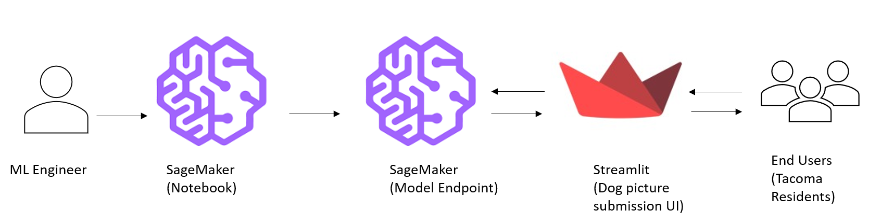

# Artificial Intelligence (AI)-for-Good: partnering with Habitat for Canines (H4C) Dog Shelter to assist caring citizens

This is a simple readme for my Udacity capstone project for the Machine Learning Engineer with AWS course
See the app [here](http://44.202.11.201:8501/)

## Context

H4C is a (fictitious) dog shelter in Tacoma that cares for about 10,000 pets each year. They reunite lost pets and their owners, and they provide care for injured pets. They rely heavily on the community as a part of their process to gain leads on stray dogs, their locations, and breeds. They use this information from the community as part of their decision matrix on whether and how to capture the dog and triage it to the appropriate dog shelter (theirs or partner shelters).

### Problem Statement

The habitat is looking for an easier way to allow residents of Tacoma, Washington identify breeds of stray dogs. At the moment, they require residents to call and laboriously define the dob breed before H4C makes the decision to drive out to the neighborhood, capture the dog, and give it a nice home. The breed matters also because the habitat has limited capacity with certain exotic breeds but may have partners in Pierce County, Washington that can properly care for these breeds. H4C has surveyed the community and found that this need for calls is a significant blocker to receiving adequate leads on lost or abandoned dogs. Adding to this issue is the challenge of staffing. H4C struggles to find adequate and skilled staff who are available and able to handle incoming calls and correctly ascertain information, e.g., appropriate dog features, to properly identify the stray dog’s breed. Therefore, they are looking for AI advocates who can integrate an AI model into their website to automate this process and do so accurately. This web functionality allows Tacoma residents an online platform to upload dog pictures from their cell phones and get an identification of the dog breed. This also streamlines how H4C receives leads as they get the information about the dog breed, location, and can streamline the decision for how that stray dog will be captured and cared for. They require that the model has a minimum accuracy, i.e., better than human guessing, **at or above 70%**. They will settle for a little less than 70% accuracy if an end-to-end app can be deployed for this task.

### Simplified Solutions Architecture



### Defined Steps

- We use a resnet50 model
- We first identify best hyperparameters with a hyperparameter tuning job on AWS Sagemaker
- Then we use these hyperparameters, with an epoch of 50, to train our model
- We deploy the model as a Sagemaker endpoint
- We use a Lambda function to handle our inferencing and make it publicly accessible
  - We gave the lambda function the necessary permissions to access S3 bucket e.g. for accessing our dog labels for each prediction
  - In a nutshell, the lambda function calls the Sagemaker model endpoint, makes predictions, and we extract top two dog predictions
- We wrap our Lambda function behind a publicly accessible API gateway
- We test our API locally on our PC in a jupyter notebook and another way using Postman. 
- We move the API code into a Streamlit app and deploy it locally on our PC
- Then we move the app to an AWS EC2 (t2 micro) free-tier instance that will make the Streamlit app publicly accessible. 

### Some Gotchas

- If you use boto3.client() method in your streamlit app logic, then on your local computer you need to have configured your AWS Access key ID and	Secret access key using aws-cli
- Similarly, you need to do something similar for your EC2 machine so you'll encounter no errors when booting the streamlit app.
- Lastly, streamlit needs you to declare a PATH variable on your EC2 Ubuntu instance. So be sure to add this `/home/ubuntu/.local/bin`as a PATH variable before you `streamlit run app.py`. Also **ensure** to add it permanently into bash by following the `echo ... ~/.bashrc` command Rahul Ag. outlined in his Medium post - see 'Streamlit on AWS' reference below.

### Results

The best performing scored 80% accuracy on the test. Hence, **we surpass our user requirement for at least a 70% accuracy**. The best model had the following hyperparameters:  

```
{
  learning rate: 0.004120510525842499
  batch_size: 512
}

epoch = 50
```

We succesfully deployed the app with very low latency. It can be viewed here at: <http://44.202.11.201:8501/> for a limited time. 

### Future considerations

We would like to improve this app in the following ways:

- Security, security, security. We would like to better grant least privilege permisions across every piece of our architecture e.g. assigning an IAM role to the EC2 instance hosting the app
- Replace the use of boto3.client() method with another Lambda function that separately handles user-uploaded images
- Beautify our app's UI/UX. 
- Improve the accuracy of our model e.g. via tuning and training for more epochs, using a different image classifier other than resnet50, leverage GPU computes for training etc.

See our `project/*` folder for our Lamda tests and streamlit/dog_app.py for our our app logic and references to resources that help me along the way.  

### References

- For deploying Streamlit on AWS: <https://towardsdatascience.com/how-to-deploy-a-streamlit-app-using-an-amazon-free-ec2-instance-416a41f69dc3>
- API Gateway + Lambda integration: AWS Docs - <https://go.aws/3OgruOf> [AND] Data Science Garage - <https://bit.ly/3HkXpem>
- Other references are in their associated scripts e.g. in the `./lambda` and `./streamlit` folders
